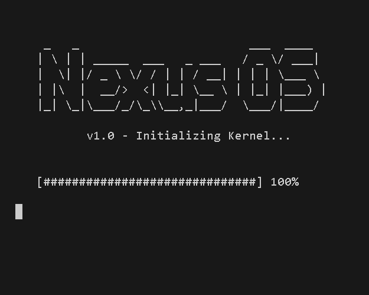
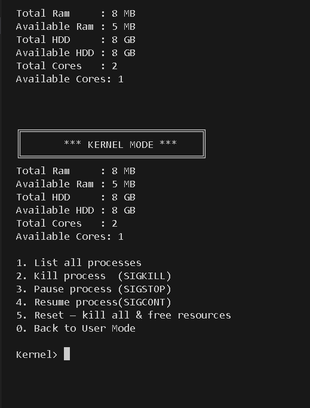
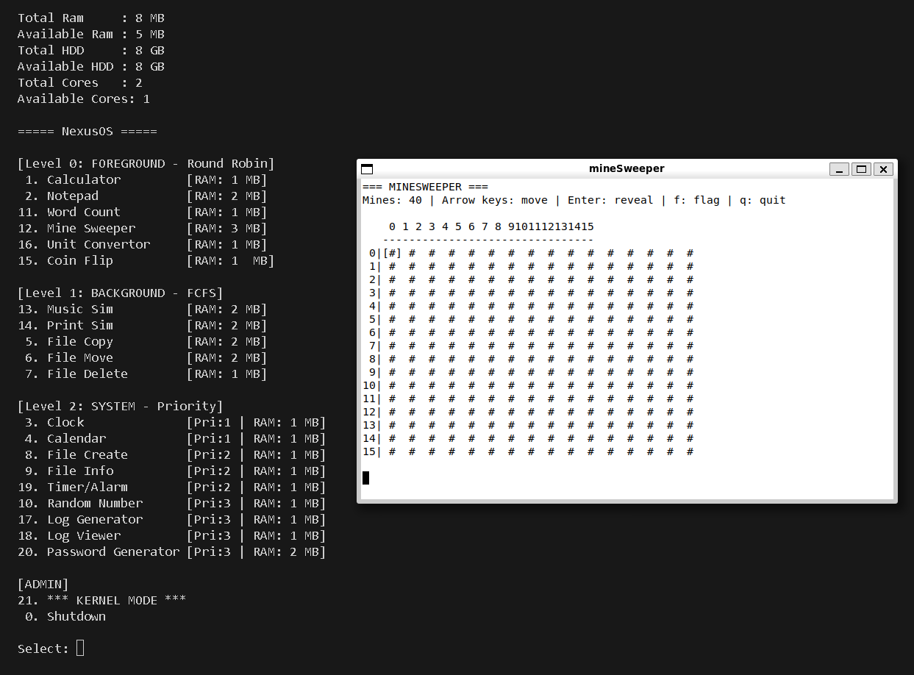
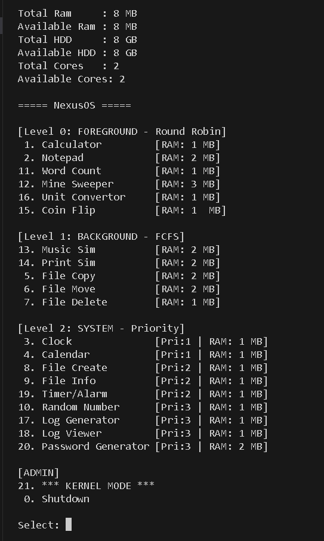
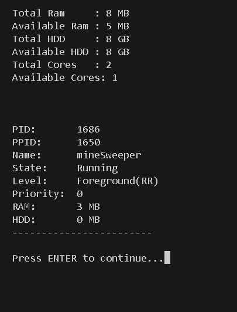

# NEXUS OS — Operating System Simulator

A Linux-based OS simulator written in C++ that simulates real process management, memory allocation, scheduling, and multitasking — each application runs as an independent process in its own xterm terminal.








---

## Why I Built This

This was my OS Lab final project at FAST NUCES. I wanted to go beyond theory and actually implement the concepts — real `fork()` calls, pipe-based IPC, POSIX synchronization, and a working multilevel scheduler. The biggest challenge was getting processes to negotiate memory with the kernel through pipes before being allowed to run.

---

## Tech Stack

- **Language:** C++17
- **Platform:** Linux (Ubuntu)
- **IPC:** Anonymous Pipes
- **Terminal:** xterm (one per process)
- **Threading:** POSIX pthreads
- **Sync:** `pthread_mutex_t`, `sem_t`, `pthread_cond_t`
- **Signals:** `SIGSTOP`, `SIGCONT`, `SIGCHLD`

---

## Features

- **True multiprocessing** — every task is a real child process via `fork()` + `execlp()`, no function calls
- **Pipe-based memory negotiation** — processes request RAM/HDD from the kernel before starting; denied if resources are full
- **Multilevel ready queue** — Round Robin on L1, Priority on L2; context switching via signals
- **User & Kernel mode** — kernel mode allows live process termination and memory inspection
- **20+ built-in tasks** — foreground (Calculator, Notepad, Game), background (Music, File Copy), and system utilities (Clock, RAM Viewer, Logger)

---

## Setup

```bash
# Install dependencies
sudo apt install g++ xterm

# Clone the repo
git clone https://github.com/yourusername/nexus-os.git
cd nexus-os

# manually
g++ os.cpp -o NEXUS -lpthread
```

---

## Usage

```bash
./NEXUS <RAM_GB> <HDD_GB> <CPU_CORES>

# Example: 2GB RAM, 256GB HDD, 8 cores
./NEXUS 2 256 8
```

NEXUS boots with a loading animation, then shows a task menu. Select any task to launch it in a new xterm window. Press `21` for Kernel Mode to manage running processes. Press `0` to shut down.

---

## Project Structure

```
nexus-os/
├── assets/                          # Screenshots for README
│   ├── boot.png
│   └── menu.png
├── os.cpp
├── config.h
├── process.h
├── resource.cpp / .h
├── kernel.cpp / .h
├── ready_queue.cpp / .h
├── scheduler.cpp / .h
└── tasks/                           # 20 separate task binaries
```